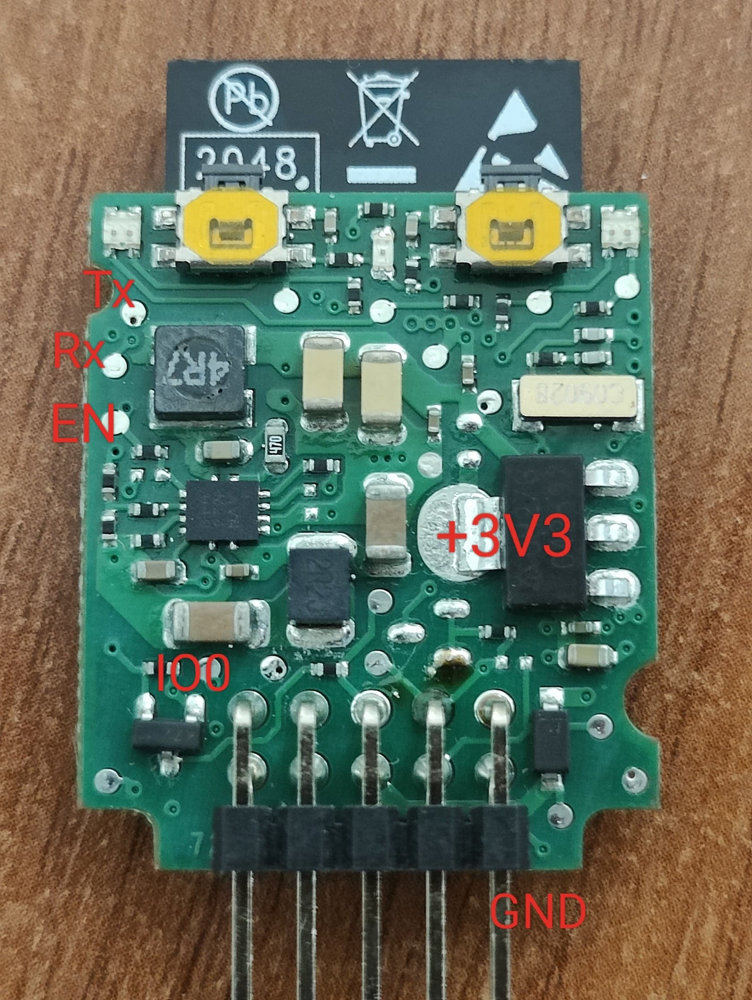

# Nice Bus-T4 ESPHome Component

[](https://www.gnu.org/licenses/gpl-3.0)
[](https://esphome.io/)
[](https://www.espressif.com/en/products/socs/esp32)

ESPHome component for integrating **Nice gate and garage door automation** into Home Assistant via the Bus-T4 protocol.

> **Perfect for Nice BiDi-WiFi module owners** who want local control without cloud dependency!

## Features

- 🏠 **Home Assistant** - Native ESPHome integration
- 🔒 **Local control** - No cloud, no internet required
- 🚪 **Full gate control** - Open, close, stop, and partial opening commands
- 📊 **Real-time status** - Opening, closing, stopped, fully open/closed states
- 📏 **Position tracking** - Time-based estimation with encoder priority when available
- 🧠 **Auto-learning** - Automatically learns and re-learns your gate's open/close timing
- ⚙️ **Motor configuration** - Control auto-close, standby, peak mode, and more via SET commands
- 🔧 **Wide compatibility** - Device-specific handling for Walky, Robus, Road 400, and more
- 📡 **OXI receiver logging** - Remote control button presses are logged for debugging

## Supported Hardware

### Nice BiDi-WiFi Module (Recommended)

The [Nice BiDi-WiFi](https://www.niceforyou.com/uk/nicepost/bidi-wifi-new-pocket-programming-interface) module contains an ESP32-WROOM and connects directly to your Nice gate controller. By flashing ESPHome firmware, you get local Home Assistant control.

### Compatible Nice Controllers

Tested with:
- Nice Robus (RBS400, RBS600, RBS800, etc.)

Should work with:
- Nice Walky (WLA1)
- Nice Road 400
- Nice Spin (SPn21)

Should work with any Nice controller that has a Bus-T4 port (RJ11 connector).

**Device-specific features:**
- **Walky gates**: Uses 1-byte position values (auto-detected)
- **Robus gates**: Position queries disabled during movement (auto-detected)
- **Road 400**: Alternate status codes supported (0x83/0x84)

## Quick Start

### Flash Nice BiDi-WiFi Module

#### Step 1: Backup Original Firmware

**⚠️ Important:** Before flashing, backup the original firmware so you can restore it if needed.

```bash
esptool.py --port /dev/ttyUSB0 read_flash 0x0 0x400000 bidiwifi_backup.bin
```

#### Step 2: Connect for Flashing

Use the test points on the BiDi-WiFi board:



| Test Point | Connect To |
|------------|------------|
| Tx         | USB-TTL RX |
| Rx         | USB-TTL TX |
| IO0        | GND (hold during reset to enter flash mode) |
| EN         | 3.3V |
| +3V3       | 3.3V |
| GND        | Ground |

#### Step 3: Create Configuration

Create a `gate.yaml` file:

```yaml
esphome:
  name: gate
  friendly_name: Gate

esp32:
  board: esp32dev
  framework:
    type: esp-idf

logger:
  baud_rate: 0  # Disable serial logging (UART used for Bus-T4)

api:
  encryption:
    key: !secret api_encryption_key

ota:
  - platform: esphome
    password: !secret ota_password

wifi:
  ssid: !secret wifi_ssid
  password: !secret wifi_password
  ap:
    ssid: "Gate Fallback"
    password: !secret fallback_password

external_components:
  - source:
      type: git
      url: https://github.com/makstech/esphome-BusT4
    components: [bus_t4]

uart:
  tx_pin: GPIO21
  rx_pin: GPIO18
  baud_rate: 19200

bus_t4:
  id: bus

cover:
  - platform: bus_t4
    name: "Gate"
    id: gate
```

#### Step 4: Flash and Connect

```bash
esphome run gate.yaml
```

## Configuration

### Full Example

```yaml
external_components:
  - source:
      type: git
      url: https://github.com/makstech/esphome-BusT4
    components: [bus_t4]

uart:
  tx_pin: GPIO21
  rx_pin: GPIO18
  baud_rate: 19200

bus_t4:
  id: bus
  address: 0x5090  # Optional: custom device address

cover:
  - platform: bus_t4
    name: "Gate"
    id: gate
    auto_learn_timing: true       # Auto-learn open/close duration
    open_duration: 20s            # Initial/fallback open time
    close_duration: 20s           # Initial/fallback close time
    position_report_interval: 1s  # Position update rate

# Optional: Additional control buttons
button:
  - platform: template
    name: "Partial Open"
    icon: "mdi:gate-arrow-right"
    on_press:
      - lambda: id(gate).send_cmd(CMD_OPEN_PARTIAL_1);

  - platform: template
    name: "Step-by-Step"
    icon: "mdi:gate"
    on_press:
      - lambda: id(gate).send_cmd(CMD_STEP);
```

### Configuration Variables

#### bus_t4 Component

| Variable | Type | Default | Description |
|----------|------|---------|-------------|
| `address` | hex | `0x5090` | Device address on the bus |

#### Cover Platform

| Variable | Type | Default | Description |
|----------|------|---------|-------------|
| `name` | string | *Required* | Name for Home Assistant |
| `auto_learn_timing` | boolean | `true` | Auto-learn open/close duration |
| `open_duration` | time | `20s` | Initial/fallback time to fully open |
| `close_duration` | time | `20s` | Initial/fallback time to fully close |
| `position_report_interval` | time | `1s` | How often to update position during movement |

### Available Commands

Use in lambdas with `id(gate).send_cmd(COMMAND)`:

| Command | Description |
|---------|-------------|
| `CMD_OPEN` | Open gate |
| `CMD_CLOSE` | Close gate |
| `CMD_STOP` | Stop movement |
| `CMD_STEP` | Step-by-step (toggle) |
| `CMD_OPEN_PARTIAL_1` | Partial open position 1 |
| `CMD_OPEN_PARTIAL_2` | Partial open position 2 |
| `CMD_OPEN_PARTIAL_3` | Partial open position 3 |

### Motor Controller Configuration

You can change motor controller settings via lambdas. These send SET commands to the controller:

| Method | Description |
|--------|-------------|
| `set_auto_close(bool)` | L1 - Enable/disable auto-close after opening |
| `set_photo_close(bool)` | L2 - Close after photo sensor clears |
| `set_always_close(bool)` | L3 - Always close (ignore hold-open) |
| `set_standby(bool)` | Enable/disable standby mode (power saving) |
| `set_peak_mode(bool)` | Enable/disable peak mode (faster operation) |
| `set_pre_flash(bool)` | Enable/disable pre-flash warning light |

Example usage with buttons:

```yaml
button:
  - platform: template
    name: "Enable Auto-Close"
    on_press:
      - lambda: id(gate).set_auto_close(true);

  - platform: template
    name: "Disable Auto-Close"
    on_press:
      - lambda: id(gate).set_auto_close(false);
```

Example usage with switches:

```yaml
switch:
  - platform: template
    name: "Auto-Close"
    icon: "mdi:timer"
    optimistic: true
    turn_on_action:
      - lambda: id(gate).set_auto_close(true);
    turn_off_action:
      - lambda: id(gate).set_auto_close(false);

  - platform: template
    name: "Pre-Flash Warning"
    icon: "mdi:alarm-light"
    optimistic: true
    turn_on_action:
      - lambda: id(gate).set_pre_flash(true);
    turn_off_action:
      - lambda: id(gate).set_pre_flash(false);
```

## How Position Tracking Works

This component uses **multiple strategies** for accurate position tracking:

### 1. Encoder Position (Primary when available)

For devices that support it, the component polls encoder position during movement every 500ms. This provides the most accurate position tracking.

- Encoder data is prioritized when available (updated within last 2 seconds)
- Automatically detected - no configuration needed

> **Note**: Robus devices don't support position queries during movement

### 2. Time-Based Estimation (Fallback)

1. **Auto-Learning**: When the gate performs a complete movement (fully closed → fully open or vice versa), the duration is measured and saved
2. **Position Calculation**: During movement, position is calculated based on elapsed time
3. **Persistence**: Learned durations are stored in flash and survive reboots
4. **Adaptive**: If timing deviates >10% from stored value, it's automatically updated
5. **Smart Fallback**: Only used when encoder data is unavailable or stale

### 3. Limit Switch Confirmation

When the gate stops, the component queries the controller's I/O state (INF_IO) to confirm if a limit switch is active. This ensures accurate detection of fully open/closed states even if the time-based estimate is slightly off.

### 4. Periodic Status Refresh

Every 15 seconds, the component requests a status update from the controller. This helps:
- Recover from missed packets
- Keep state synchronized
- Detect external changes (e.g., remote control operation)

### Learning Requirements

- Only learns from **complete** movements (end-to-end)
- Duration must be between 3 seconds and 5 minutes
- Interrupted movements don't update learned values

## Device Detection

During initialization, the component queries the controller for product information and automatically enables device-specific handling:

| Product | Mode | Special Handling |
|---------|------|------------------|
| WLA1 (Walky) | `is_walky` | Uses 1-byte position values |
| ROBUSHSR10 | `is_robus` | No position queries during movement |
| Road 400 | Standard | Alternate status codes (0x83/0x84) |

Device information (manufacturer, product, firmware) is logged at startup.

## Troubleshooting

### Position not updating

1. Wait for a complete open/close cycle for auto-learning
2. Check logs for "Learned new open/close duration" messages
3. Manually set `open_duration` and `close_duration` if auto-learning fails

### BiDi-WiFi won't enter flash mode

1. Hold IO0 to GND
2. Briefly disconnect EN from +3V3 (reset)
3. Release IO0
4. Start flashing immediately

## Contributing

Contributions are welcome! Please:

1. Fork the repository
2. Create a feature branch
3. Submit a pull request

## Credits

- Original Bus-T4 work by [@pruwait](https://github.com/pruwait/Nice_BusT4)
- BiDi-WiFi firmware by [@gashtaan](https://github.com/gashtaan/nice-bidiwifi-firmware)
- Initial ESPHome ESP32 PoC by [@andrein](https://github.com/andrein/esphome-BusT4)

## License

This project is licensed under the GNU General Public License v3.0 - see the [LICENSE](LICENSE) file for details.

## Related Resources

- [Home Assistant Community Discussion](https://community.home-assistant.io/t/nice-app-with-bidi-wifi-gate-automation/606241)
- [Nice BiDi-WiFi Product Page](https://www.niceforyou.com/uk/nicepost/bidi-wifi-new-pocket-programming-interface)
- [ESPHome Documentation](https://esphome.io/)

### Nice Resources:

- [TTPCI](https://www.niceforyou.com/sites/default/files/upload/manuals/IS0326A00MM.pdf)
- [DMBM](https://www.niceforyou.com/sites/default/files/upload/manuals/nice_dmbm_integration_protocol.pdf)
