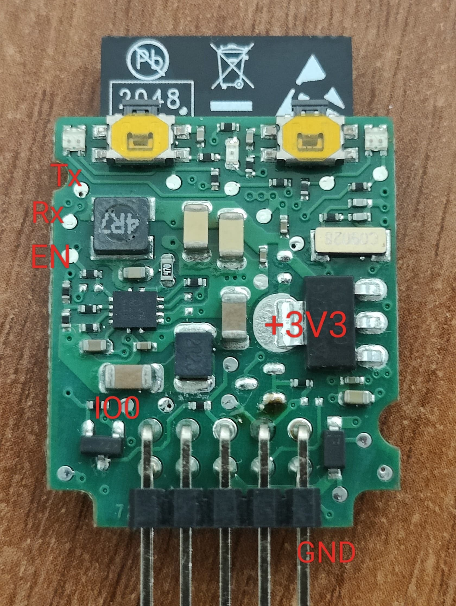

# Nice Bus-T4 ESPHome Component

[](https://www.gnu.org/licenses/gpl-3.0)
[](https://esphome.io/)
[](https://www.espressif.com/en/products/socs/esp32)

ESPHome component for integrating **Nice gate and garage door automation** into Home Assistant via the Bus-T4 protocol.

> **Perfect for Nice BiDi-WiFi module owners** who want local control without cloud dependency!

## Features

- 🏠 **Home Assistant** - Native ESPHome integration
- 🔒 **Local control** - No cloud, no internet required
- 🚪 **Full gate control** - Open, close, stop, and partial opening commands
- 📊 **Real-time status** - Opening, closing, stopped, fully open/closed states
- 📏 **Position tracking** - Time-based estimation with encoder priority when available
- 🧠 **Auto-learning** - Automatically learns and re-learns your gate's open/close timing
- ⚙️ **Motor configuration** - Control auto-close, standby, surge mode, and more via SET commands
- 🔧 **Wide compatibility** - Device-specific handling for Walky, Robus, Road 400, and more
- 📡 **OXI receiver logging** - Remote control button presses are logged for debugging

## Supported Hardware

### Nice BiDi-WiFi Module (Recommended)

The [Nice BiDi-WiFi](https://www.niceforyou.com/uk/nicepost/bidi-wifi-new-pocket-programming-interface) module contains an ESP32-WROOM and connects directly to your Nice gate controller. By flashing ESPHome firmware, you get local Home Assistant control.

### Compatible Nice Controllers

Tested with:
- Nice Robus (RBS400, RBS600, RBS800, etc.)

Should work with:
- Nice Walky (WLA1)
- Nice Road 400
- Nice Spin (SPn21)

Should work with any Nice controller that has a Bus-T4 port.

**Device-specific features:**
- **Walky gates**: Uses 1-byte position values (auto-detected)
- **Robus gates**: Position queries disabled during movement (auto-detected)
- **Road 400**: Alternate status codes supported (0x83/0x84)

## Quick Start

### Flash Nice BiDi-WiFi Module

#### Step 1: Backup Original Firmware

**⚠️ Important:** Before flashing, backup the original firmware so you can restore it if needed.

```bash
esptool.py --port /dev/ttyUSB0 read_flash 0x0 0x400000 bidiwifi_backup.bin
```

#### Step 2: Connect for Flashing

Use the test points on the BiDi-WiFi board:



| Test Point | Connect To |
|------------|------------|
| Tx         | USB-TTL RX |
| Rx         | USB-TTL TX |
| IO0        | GND (hold during reset to enter flash mode) |
| EN         | 3.3V |
| +3V3       | 3.3V |
| GND        | Ground |

#### Step 3: Create Configuration

Create a `gate.yaml` file:

```yaml
esphome:
  name: gate
  friendly_name: Gate

esp32:
  board: esp32dev
  framework:
    type: esp-idf
    advanced:
      # BiDi-WiFi uses ESP32 rev3.1 - reduces binary size by excluding legacy silicon workarounds.
      # Safe to use with OTA: incompatible chips will reject the firmware and roll back automatically.
      # Remove or adjust for custom ESP32 hardware with a different chip revision.
      minimum_chip_revision: "3.1"

logger:
  baud_rate: 0  # Disable serial logging (UART used for Bus-T4)

api:
  encryption:
    key: !secret api_encryption_key

ota:
  - platform: esphome
    password: !secret ota_password

wifi:
  ssid: !secret wifi_ssid
  password: !secret wifi_password
  ap:
    ssid: "Gate Fallback"
    password: !secret fallback_password

external_components:
  - source:
      type: git
      url: https://github.com/makstech/esphome-BusT4
    components: [bus_t4]

uart:
  tx_pin: GPIO21
  rx_pin: GPIO18
  baud_rate: 19200

bus_t4:
  id: bus
  control_unit:
    name: "Gate"
    cover:
      name: "Gate"
      id: gate
```

> **Note**: The `minimum_chip_revision: "3.1"` setting is specific to the Nice BiDi-WiFi module (ESP32 rev3.1). It reduces binary size by excluding legacy workaround code. Safe to use with OTA updates — if the chip revision doesn't match, ESPHome will reject the firmware and automatically roll back. Remove or adjust for custom ESP32 hardware. See [ESPHome ESP32 advanced configuration](https://esphome.io/components/esp32/#advanced-configuration) for details.

#### Step 4: Flash and Connect

```bash
esphome run gate.yaml
```

## Configuration

### Full Example

```yaml
external_components:
  - source:
      type: git
      url: https://github.com/makstech/esphome-BusT4
    components: [bus_t4]

uart:
  tx_pin: GPIO21
  rx_pin: GPIO18
  baud_rate: 19200

bus_t4:
  id: bus
  address: 0x5090  # Optional: this ESP module's own bus address
  control_unit:
    name: "Gate"
    cover:
      name: "Gate"
      id: gate
      auto_learn_timing: true       # Auto-learn open/close duration
      open_duration: 20s            # Initial/fallback open time
      close_duration: 20s           # Initial/fallback close time
      position_report_interval: 1s  # Position update rate
    # Config flags: bare type, or a map with name/icon overrides
    flags:
      - auto_close
      - photo_close
      - type: surge
        name: "Starting torque"
        icon: "mdi:flash"

# Optional: Additional control buttons
button:
  - platform: template
    name: "Partial Open"
    icon: "mdi:gate-arrow-right"
    on_press:
      - lambda: id(gate).send_cmd(CMD_OPEN_PARTIAL_1);

  - platform: template
    name: "Step-by-Step"
    icon: "mdi:gate"
    on_press:
      - lambda: id(gate).send_cmd(CMD_STEP);
```

### Configuration Variables

#### bus_t4 Component

| Variable | Type | Default | Description |
|----------|------|---------|-------------|
| `address` | hex | `0x5090` | This ESP module's own bus address (the `from` field) |
| `control_unit` | block | — | The motor controller and its entities (see below) |

#### control_unit

| Variable | Type | Default | Description |
|----------|------|---------|-------------|
| `name` | string | — | Name prefix for auto-created entities |
| `address` | hex | *auto* | Controller address override; auto-detected via `INF_WHO` when omitted |
| `cover` | block | — | The gate cover (options below) |
| `flags` | list | — | Config-flag `switch`es (types below) |
| `numbers` | list | — | Numeric param `number`s (types below) |
| `selects` | list | — | Enumerated param `select`s (types below) |
| `sensors` | list | — | Read-only `sensor`s polled from the controller (types below) |
| `buttons` | list | — | Action `button`s that write a fixed value (types below) |
| `diagnostics` | bool/map | — | `true` adds firmware/product/hardware/description text sensors plus bus-error and bus-timeout counters (or a map to rename them) |

Every `flags`/`numbers`/`selects`/`sensors`/`buttons` entry is a bare type name **or** a map with per-entity overrides (`name`, `icon`, `id`, …). Settable entities send a SET on change and also track GET/SET replies on the bus, so changes made elsewhere (Oview, another client) are reflected immediately. A param the controller doesn't support shows as unavailable.

`cover` options: `name` (*required*), `auto_learn_timing` (`true`), `open_duration` (`20s`), `close_duration` (`20s`), `position_report_interval` (`1s`).

```yaml
bus_t4:
  id: bus
  control_unit:
    name: "Gate"
    flags: [photo_close, auto_close]
    numbers: [pause_time, standby_time]
    selects: [step_by_step, standby_mode]
    sensors: [total_maneuvers]
    buttons: [reset_maintenance]
```

##### `flags` types (`switch`)

<!-- BEGIN SWITCH_TYPES -->
| `type` | Description |
|---|---|
| `auto_close` | Auto-close |
| `photo_close` | Close after photo |
| `always_close` | Always-close |
| `standby` | Stand-by |
| `surge` | Surge |
| `pre_flash` | Pre-flashing |
| `disable_internal_radio` | Disable internal radio |
| `slave` | Slave mode |
| `automation_lock` | Automation lock |
| `keylock` | Keylock |
<!-- END SWITCH_TYPES -->

##### `numbers` types (`number`)

<!-- BEGIN NUMBER_TYPES -->
| `type` | Description | Range |
|---|---|---|
| `pause_time` | Auto-close pause time | 0–240 s |
| `speed_opening` | Opening speed | 25–100 % |
| `speed_closing` | Closing speed | 25–100 % |
| `force_opening` | Opening force | 0–100 % |
| `force_closing` | Closing force | 0–100 % |
| `maintenance_threshold` | Maintenance threshold | 100–20000 |
| `photo_close_time` | Close after photo time | 0–250 s |
| `always_close_time` | Always-close time | 0–20 s |
| `standby_time` | Stand-by time | 5–250 s |
| `surge_time` | Surge time | 1–10 s |
| `pre_flash_open_time` | Opening pre-flash time | 1–10 s |
| `pre_flash_close_time` | Closing pre-flash time | 1–10 s |
| `max_work_time` | Maximum work time | 10–250 s |
| `courtesy_light_time` | Courtesy light time | 0–240 s |
| `electric_lock_time` | Electric lock time | 0.1–10 s |
| `suction_cup_time` | Suction cup time | 0.1–10 s |
| `brief_reversal` | Brief reversal | 0.5–5 s |
<!-- END NUMBER_TYPES -->

##### `selects` types (`select`)

<!-- BEGIN SELECT_TYPES -->
| `type` | Description |
|---|---|
| `step_by_step` | Step-by-Step mode |
| `output_1` | Output 1 function |
| `output_2` | Output 2 function |
| `output_3` | Output 3 function |
| `output_4` | Output 4 function |
| `output_5` | Output 5 function |
| `output_6` | Output 6 function |
| `maintenance_management` | Maintenance management |
| `photo_close_mode` | Close after photo mode |
| `always_close_mode` | Always-close mode |
| `standby_mode` | Stand-by mode |
<!-- END SELECT_TYPES -->

##### `sensors` types (`sensor`, read-only)

<!-- BEGIN SENSOR_TYPES -->
| `type` | Description |
|---|---|
| `maintenance_count` | Maintenance counter |
| `total_maneuvers` | Total maneuvers |
<!-- END SENSOR_TYPES -->

##### `buttons` types (`button`, momentary)

<!-- BEGIN BUTTON_TYPES -->
| `type` | Description |
|---|---|
| `reset_maintenance` | Reset maintenance counter |
<!-- END BUTTON_TYPES -->

### Available Commands

Use in lambdas with `id(gate).send_cmd(COMMAND)`:

| Command | Description |
|---------|-------------|
| `CMD_OPEN` | Open gate |
| `CMD_CLOSE` | Close gate |
| `CMD_STOP` | Stop movement |
| `CMD_STEP` | Step-by-step (toggle) |
| `CMD_OPEN_PARTIAL_1` | Partial open position 1 |
| `CMD_OPEN_PARTIAL_2` | Partial open position 2 |
| `CMD_OPEN_PARTIAL_3` | Partial open position 3 |

### Security Commands (Lock/Block)

Security commands require the IT4WIFI device identity. Use `send_cmd(COMMAND, IT4WIFI)`:

| Command | Description |
|---------|-------------|
| `CMD_BLOCK` | Lock the motor |
| `CMD_RELEASE` | Unlock the motor |
| `CMD_OPEN_AND_BLOCK` | Open gate, then lock |
| `CMD_CLOSE_AND_BLOCK` | Close gate, then lock |
| `CMD_RELEASE_AND_OPEN` | Unlock, then open |
| `CMD_RELEASE_AND_CLOSE` | Unlock, then close |

Example lock entity:

```yaml
lock:
  - platform: template
    name: "Gate Lock"
    optimistic: true
    on_lock:
      - lambda: 'id(gate).send_cmd(CMD_BLOCK, IT4WIFI);'
    on_unlock:
      - lambda: 'id(gate).send_cmd(CMD_RELEASE, IT4WIFI);'
```

### Raw Configuration Parameters

For on/off configuration flags (auto-close, standby, etc.), use the
[Switch Platform](#switch-platform). For numeric parameters not yet covered by
a platform, you can set any controller parameter by its raw hex address using
`send_config_set()`:

```yaml
number:
  - platform: template
    name: "Motor Force"
    min_value: 0
    max_value: 100
    step: 5
    set_action:
      - lambda: 'id(gate).send_config_set(0x92, (uint8_t)x);'

  - platform: template
    name: "Pause Duration"
    min_value: 0
    max_value: 250
    unit_of_measurement: "s"
    set_action:
      - lambda: 'id(gate).send_config_set(0x88, (uint8_t)x);'
```

### Sending Commands for Debugging

Two component methods let you push commands onto the bus at runtime (no reflash). Each sends, waits for the reply, and **returns it as a hex string** (or `"no reply"` on timeout, `""` on bad input); the reply is also logged (`[debug] RX: ...`):

- `id(bus)->debug_request(message)` — a DMP request to the control unit; supply only the message bytes and the header, `55`/size framing and both checksums are added for you. Returns as soon as the reply with the matching command byte arrives.
- `id(bus)->debug_request_raw(frame)` — sends a byte-exact frame (you supply the whole thing including framing and checksums) and returns on the first non-echo reply.

These are thin hex wrappers over the component's send primitives: `dep_send()` / `dmp_send()` (fire-and-forget) and `dmp_request()` (waits for the reply) — the same primitives `send_cmd()` and the switch platform use.

Both accept hex in any format (`"04 D1 99"`, `"04.D1.99"` or `"04D199"` — non-hex characters are stripped). They block the main loop only until the reply lands (typically ~150 ms), or until `timeout_ms` (default 500) on no reply.

The cleanest way to call them at runtime is via Home Assistant actions. Wrap a send in `api.respond` to return the reply to the caller:

```yaml
api:
  actions:
    # Each returns {"reply": "<hex>"} to the caller.
    - action: debug_request
      variables:
        message: string
      then:
        - api.respond:
            data: !lambda 'root["reply"] = id(bus)->debug_request(message);'
    - action: debug_request_raw
      variables:
        frame: string
      then:
        - api.respond:
            data: !lambda 'root["reply"] = id(bus)->debug_request_raw(frame);'
```

Call it from Developer Tools → Actions with "return response":

```yaml
action: esphome.gate_debug_request_raw
data:
  frame: "55.0D.00.03.00.81.08.06.8C.04.08.89.00.00.85.0D"
# response -> {"reply": "00.81.00.03..."}
```

> **Note**: `api.respond` needs ESPHome 2025.12+; `supports_response` is auto-detected (`optional`) when the action returns data.

## How Position Tracking Works

This component uses **multiple strategies** for accurate position tracking:

### 1. Encoder Position (Primary when available)

For devices that support it, the component polls encoder position during movement every 500ms. This provides the most accurate position tracking.

- Encoder data is prioritized when available (updated within last 2 seconds)
- Automatically detected - no configuration needed

> **Note**: Robus devices don't support position queries during movement

### 2. Time-Based Estimation (Fallback)

1. **Auto-Learning**: When the gate performs a complete movement (fully closed → fully open or vice versa), the duration is measured and saved
2. **Position Calculation**: During movement, position is calculated based on elapsed time
3. **Persistence**: Learned durations are stored in flash and survive reboots
4. **Adaptive**: If timing deviates >10% from stored value, it's automatically updated
5. **Smart Fallback**: Only used when encoder data is unavailable or stale

### 3. Limit Switch Confirmation

When the gate stops, the component queries the controller's I/O state (INF_IO) to confirm if a limit switch is active. This ensures accurate detection of fully open/closed states even if the time-based estimate is slightly off.

### 4. Periodic Status Refresh

Every 15 seconds, the component requests a status update from the controller. This helps:
- Recover from missed packets
- Keep state synchronized
- Detect external changes (e.g., remote control operation)

### Learning Requirements

- Only learns from **complete** movements (end-to-end)
- Duration must be between 3 seconds and 5 minutes
- Interrupted movements don't update learned values

## Device Detection

During initialization, the component queries the controller for product information and automatically enables device-specific handling:

| Product | Mode | Special Handling |
|---------|------|------------------|
| WLA1 (Walky) | `is_walky` | Uses 1-byte position values |
| ROBUSHSR10 | `is_robus` | No position queries during movement |
| Road 400 | Standard | Alternate status codes (0x83/0x84) |

Device information (manufacturer, product, firmware) is logged at startup.

## Troubleshooting

### Position not updating

1. Wait for a complete open/close cycle for auto-learning
2. Check logs for "Learned new open/close duration" messages
3. Manually set `open_duration` and `close_duration` if auto-learning fails

### BiDi-WiFi won't enter flash mode

1. Hold IO0 to GND
2. Briefly disconnect EN from +3V3 (reset)
3. Release IO0
4. Start flashing immediately

## Contributing

Contributions are welcome! Please:

1. Fork the repository
2. Create a feature branch
3. Submit a pull request

## Credits

- Original Bus-T4 work by [@pruwait](https://github.com/pruwait/Nice_BusT4)
- BiDi-WiFi firmware by [@gashtaan](https://github.com/gashtaan/nice-bidiwifi-firmware)
- Initial ESPHome ESP32 PoC by [@andrein](https://github.com/andrein/esphome-BusT4)

## License

This project is licensed under the GNU General Public License v3.0 - see the [LICENSE](LICENSE) file for details.

## Related Resources

- [Home Assistant Community Discussion](https://community.home-assistant.io/t/nice-app-with-bidi-wifi-gate-automation/606241)
- [Nice BiDi-WiFi Product Page](https://www.niceforyou.com/uk/nicepost/bidi-wifi-new-pocket-programming-interface)
- [ESPHome Documentation](https://esphome.io/)
  
### Schematics

- [BiDi-WiFi schematic](https://github.com/gashtaan/nice-bidiwifi-firmware/blob/e6bc474c782ba9cd9ef3ada83a24e4970b281ae0/schematics/bidiwifi.pdf)
- [Pinout for 10-pin Bus4T](https://github.com/xdanik/Nice_BusT4/blob/9faa86262692da99e75979662b4f4ac555746ebf/img/connector.jpg)

### Nice Resources

- [TTPCI](https://www.niceforyou.com/sites/default/files/upload/manuals/IS0326A00MM.pdf)
- [DMBM](https://www.niceforyou.com/sites/default/files/upload/manuals/nice_dmbm_integration_protocol.pdf)
